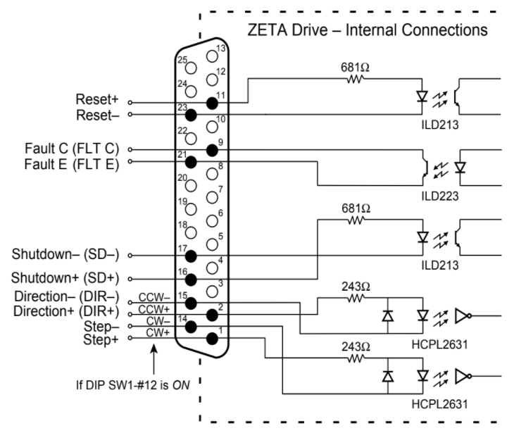

# Zeta 4 Drive

Getting an Arduino UNO to talk to a Parker Zeta4 drive

## Wiring the Drive
Wire the 25 Pin D Connector according to the following drawing:

### Step
Type: Input  
Pins: STEP+ & STEP-  
Step: Voltage Applied (step occurs on rising edge)

Input Current | Current (mA)
--------------|-------------------------------------------
Minimum       | 6.5 mA
Maximum       | 15 mA
 

Input Voltage | Voltage (VDC)
--------------|-------------------------------------------
Minimum       | 3.5 V (min. required for on or high signal)
Maximum       | 5.2 V
 

Step Pulse: 200 nanosecond minimum pulse width  
200 nanosecond minimum off time  
2 MHz maximum pulse rate  
 

### Direction
Type: Input  
Pins: DIR+ & DIR-  
CCW: 0V or negative voltage between DIR+ & DIR-  
CW: Positive voltage between DIR+ & DIR-  

Input Current | Current (mA)
--------------|-------------------------------------------
Minimum       | 6.5 mA
Maximum       | 15 mA
 

Input Voltage | Voltage (VDC)
--------------|-------------------------------------------
Minimum       | 3.5 V (min. required for on or high signal)
Maximum       | 5.2 V
 

### Clockwise & Counterclockwise
Type: Input  
Pins: CCW+ & CW-  

Pin # | SW1-#12 OFF     | SW1-#12 ON
------|-----------------|---------------------------------
1     | STEP+           | CW+
14    | STEP-           | CW-
2     | DIR+            | CCW+
15    | DIR-            | CCW-
 

### Shutdown
Type: Input  
Pins: SD+ & SD-  
Shutdown: Voltage Applied  
Normal Operation: Voltage Removed  

Input Current | Current (mA)
--------------|-------------------------------------------
Minimum       | 2.5 mA
Maximum       | 30 mA
 

Input Voltage   | Voltage (VDC)
----------------|-------------------------------------------
Minimum         | 3.5 V (min. required for on or high signal)
Maximum         | 13 V
Maximum Reverse | 5 V
 

### Reset
Type: Input  
Pins: RESET+ & RESET-  
Reset: Voltage Applied  
Normal Operation: Voltage Removed

Input Current | Current (mA)
--------------|-------------------------------------------
Minimum       | 2.5 mA
Maximum       | 30 mA
 

Input Voltage   | Voltage (VDC)
----------------|-------------------------------------------
Minimum         | 3.5 V (min. required for on or high signal)
Maximum         | 13 V
Maximum Reverse | 5 V
 

Reset Voltage Pulse: 250 nanosecond minimum pulse width  

### Fault Output
Type: Output  
Pins: FLT C & FLT E  

VCE: 30 VDC  
VCESAT: 1 VDC  
Collector Current: 40 mA minimum  
Dissipation: 40 mW maximum  
 

---
## Links
[Zeta4 Drive Installation Guide](http://divapps.parker.com/divapps/emn/download/ZETA_Rev_A_Entire.pdf)  
[Zeta4 Drive Dimensional Drawings](https://www.parkermotion.com/literature/pdf/pg121_zeta_dim.pdf)  
[Zeta4 Drive DXF](http://www.parkermotion.com/bbs/Dxf/ZETA.ZIP)  